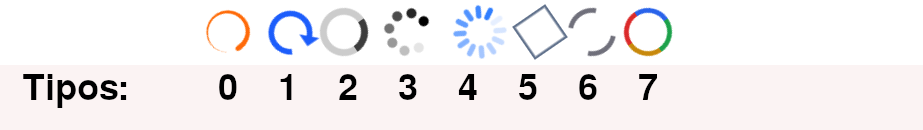

# Simple UI <!-- omit in toc -->

Biblioteca de componentes de UI para Next.js

- [1. Motivación](#1-motivación)
- [2. Principios](#2-principios)
- [3. App de ejemplo](#3-app-de-ejemplo)
- [4. Descarga y uso de Simple UI](#4-descarga-y-uso-de-simple-ui)
  - [4.1. `Alert`,](#41-alert)
  - [4.2. `Badge`](#42-badge)
  - [4.3. `Button`](#43-button)
  - [4.4. `Submit`](#44-submit)
  - [4.5. `Separator`](#45-separator)
  - [4.6. `Space`](#46-space)
  - [4.7. `Spinner`](#47-spinner)
  - [4.8. `Skeleton`](#48-skeleton)
  - [4.9. `Tooltip`](#49-tooltip)
  - [4.10. `Popover`](#410-popover)
  - [4.11. `Dropdown`](#411-dropdown)
  - [4.12. `Dropdown2`](#412-dropdown2)
  - [4.13. `MainMenu`](#413-mainmenu)
  - [4.14. `MenuLink`](#414-menulink)
  - [4.15. `Modal`](#415-modal)
  - [4.16. `Form`](#416-form)
  - [4.17. `InputText`](#417-inputtext)
  - [4.18. `InputNumber`](#418-inputnumber)
  - [4.19. `InputImage`](#419-inputimage)
  - [4.20. `InputCheck`](#420-inputcheck)
  - [4.21. `InputGroup`](#421-inputgroup)
- [5. Otras bibliotecas de UI más avanzadas](#5-otras-bibliotecas-de-ui-más-avanzadas)
    - [5.0.1. DaisyUI](#501-daisyui)
    - [5.0.2. Shadcn](#502-shadcn)


# 1. Motivación

El principal motivo por el que decidí desarrollar esta biblioteca de componentes UI es ofrecer a mi alumnado de Desarrollo de Aplicaciones Web una introducción muy básica al trabajo con componentes.

Este proyecto no pretende proporcionar código avanzado ni convertirse en una biblioteca ampliamente usada. La intención es meramente didáctica.

Se persigue que el alumno sea capaz de usar, modificar y ampliar su conjunto personalizado de componentes haciendo uso de esta biblioteca si así lo considera oportuno.

# 2. Principios

El código de este proyecto se mantendrá en todo momento lo más simple posible siguiendo los siguientes principios: 

- Carácter didáctico.
- Pensado para Next.js/TailwindCSS y SSR.
- Soporte de modos claro/oscuro.
- Descargar.
- Modificar y/o ampliar para adaptar a cada proyecto.


# 3. App de ejemplo

Existe una [aplicación web de ejemplo](https://simpleui-app.vercel.app/) desarrollada con Next.js/Tailwind cuyo código está disponible en [Simple UI App](https://github.com/jamj2000/simpleui-app). Ahí encontrarás también el enlace a la app desplegada para comprobar su funcionalidad.


# 4. Descarga y uso de Simple UI

```bash
npx  simpleui.dev  init
npx  simpleui.dev  list
```

```js
import { Alert, Button, Form } from "@/componentes/simpleui";
```


> [!note]
>
> Todos los componentes se descargaran a la carpeta `src/components/simpleui` o `components/simpleui` según tengas configurado tu proyecto.


> [!caution]
>
> **Opción incompatible con la anterior**
> 
> Este paquete también puede instalarse (dentro de `node_modules`) pero perderás la posibilidad de editar y personalizar los componentes. 
> 
> ```bash
> npm install simpleui.dev
> ```
>
> ```js
> import { Alert, Button, Form } from "simpleui.dev";
> ```


> [!NOTE]
>
> A continuación se muestran los **componentes disponibles, organizados de manera *casi alfabética*, agrupando los componentes similares.**


## 4.1. `Alert`, 

> Información con color de fondo.  

**Propiedades:**

| Nombre | Valores                       | Por defecto |
| ------ | ----------------------------- | ----------- |
| `type` | info, success, warning, error | info        |


```jsx
<Alert type="info"> 
<strong>¡Nota!</strong> Este es un mensaje de información.
</Alert>

<Alert type="success"> 
<strong>¡Éxito!</strong> Este es un mensaje de éxito.
</Alert>

<Alert type="warning"> 
<strong>¡Aviso!</strong> Este es un mensaje de aviso.
</Alert>

<Alert type="error"> 
<strong>¡Error!</strong> Este es un mensaje de error.
</Alert>
```

## 4.2. `Badge`

> Insignia con color de fondo. 

**Propiedades:**

| Nombre | Valores                       | Por defecto |
| ------ | ----------------------------- | ----------- |
| `type` | info, success, warning, error | info        |


```jsx
<Badge type="info">Nota</Badge>

<Badge type="success">Éxito</Badge>

<Badge type="warning">Aviso</Badge>

<Badge type="error">Error</Badge>
```


## 4.3. `Button`

> Botón con **funcionalidad ejecutable en el navegador** (cliente). La función a ejecutar se pasa en la propiedad `onClick`. 

```js
<Button onClick={() => alert("Mensaje mostrado en el navegador")}>
    Botón con onClick
</Button>
```


## 4.4. `Submit`

> Botón **asociado a un formulario** con **funcionalidad ejecutable en el servidor**. La función a ejecutar se pasa en el propiedad `formAction`.
> 
> **Debe aparecer obligatoriamente dentro de un formulario**. 


```js
const formData = new FormData();
formData.append("nombre", "Jose");
formData.append("pais", "Mexico");


<form>
    <Submit formAction={() => createAutor(formData)}>
        Submit Nuevo autor
    </Submit>
</form>
```

> [!NOTE]
>
> En este caso, a la función a ejecutar se la conoce como **acción del servidor** asociada a un formulario y, como su nombre indica, su código se ejecuta en el backend, normalmente para gestionar información enviada por el usuario y para realizar operaciones sobre bases de datos compartidas la mayor parte de las veces. 
 

## 4.5. `Separator`

> Línea de separación.  
> Variantes soportadas: `horizontal`, `vertical`. Por defecto horizontal.

```jsx
<Separator />

<div className="flex gap-2">
    <div>...</div>
    <Separator variant="vertical">
    <div>...</div>
</div>
```

## 4.6. `Space`

> Espacio de separación vertical entre elementos.

```jsx
<Space height={20} />
```


## 4.7. `Spinner`

> Indicador visual de carga que muestra que una operación está en curso, sin informar del progreso exacto ni del tiempo restante. Hay disponibles 8 tipos, desde 0 a 7. 



**Propiedades:**

| Nombre  | Valores         | Por defecto                |
| ------- | --------------- | -------------------------- |
| `type`  | 0,1,2,3,4,5,6,7 | 0                          |
| `size`  |                 | 10                         |
| `color` |                 | text-black dark:text-white |


`color` es el color de primer plano, tanto para modo claro como oscuro. Sigue convenio de tailwind. 


```jsx
<Spinner />
<Spinner type={0} size={16} color="text-orange-500 dark:text-orange-600" />
<Spinner type={1} size={11} color="text-blue-600 dark:text-blue-300" />
<Spinner type={2} size={12} />
<Spinner type={3} size={16} />
<Spinner type={4} size={16} color="text-blue-500 dark:text-blue-400" />
<Spinner type={5} size={10} color="text-slate-500 dark:text-slate-400" />
<Spinner type={6} size={12} color="text-zinc-500 dark:text-zinc-400" />
<Spinner type={7} size={12} />
```

> [!TIP]
>
> **Bonus**
>
> Los siguientes elementos, que no están incorporados en esta bibliotea, muestran como pueden diseñarse de forma muy simple iconos animados usando las clases `animate-spin`, `animate-bounce` y `animate-ping`.
>
>```jsx
> <div className="size-10 inline-block border-x-4 border-blue-600 dark:border-blue-500 rounded-full animate-spin" />
> <span className="text-5xl text-slate-200 animate-spin">#</span>
> <span className="text-4xl animate-pulse">🔥</span>
> <div className="inline-block text-5xl animate-bounce">🦘</div>
> <div className="inline-block text-lg text-red-500 animate-ping">❤️</div>
>```


## 4.8. `Skeleton`

> Es un marcador de posición que reproduce la estructura aproximada del contenido que aún se está cargando.  
> No admite propiedades de personalización.  
> El usuario deberá realizar una copia y personalizar manualmente el componente. 


```jsx
<Skeleton />
```


> [!TIP] 
> 
> **Posición de Tooltip, Popover, Dropdown, Dropdown2**
>
> Los 4 componentes siguientes permiten la personalización de su posición. Para ello debes modificar, en el código de la biblioteca, las clases `top-*`, `left-*`, `right-*`, `botton-*` que aparecen después de la clase `absolute`.

## 4.9. `Tooltip`

> Pequeño mensaje informativo flotante que aparece al hacer `hover` sobre el elemento contenedor padre, el cual debe tener className `group relative` para el correcto funcionamiento. La finalidad principal de los `Tooltip`s es mostrar información de ayuda.

```jsx

<div className="group relative">
    <div>
        Lorem ipsum dolor sit amet consectetur adipisicing elit. Rem minus corporis, nisi molestiae animi minima, ad architecto harum est eligendi similique ex tempora cum soluta, laborum error? Amet, recusandae explicabo.
    </div>
    <Tooltip>
        Esto es un tooltip
    </Tooltip>
</div>
``` 


## 4.10. `Popover`

> Panel flotante que aparece al hacer `hover` sobre `title` del Popover. Es similar al `Tooltip`, aunque suele usarse con paneles que contienen mayor cantidad información.

```jsx
<Popover title="Popover">
    <div className="flex flex-col gap-1">
    <Link href="#" className="hover:opacity-60 active:opacity-40">Dashboard</Link>
    <Link href="#" className="hover:opacity-60 active:opacity-40">Autores</Link>
    <Link href="#" className="hover:opacity-60 active:opacity-40">Libros</Link>
    <Link href="#" className="hover:opacity-60 active:opacity-40">Prestamos</Link>
    </div>
</Popover>
```


## 4.11. `Dropdown`

> El panel flotante permanece abierto después del `hover`. Para cerrar el panel basta con pulsar fuera del `Dropdown`.

```jsx
<Dropdown title="Dropdown" className="bg-blue-100 dark:bg-blue-500 px-4 py-2 border border-slate-300 dark:border-slate-600">
    <div className="flex flex-col gap-2">
    <Link href="#" className="hover:opacity-60 active:opacity-40">Dashboard</Link>
    <Link href="#" className="hover:opacity-60 active:opacity-40">Autores</Link>
    <Link href="#" className="hover:opacity-60 active:opacity-40">Libros</Link>
    <Link href="#" className="hover:opacity-60 active:opacity-40">Prestamos</Link>
    </div>
</Dropdown>
```


## 4.12. `Dropdown2`

> Similar a `Dropdown`. A diferencia del anterior, para cerrar el panel es necesario volver a hacer click en el `title`, no funciona pulsar fuera de `Dropdown2`. Se usa cuando queremos que el panel esté visible mientras interactuamos con el resto de la página.

```jsx
<Dropdown2 title="Dropdown2" className="bg-blue-100 dark:bg-blue-500 px-4 py-2 border border-slate-300 dark:border-slate-600">
    <div className="flex flex-col gap-2">
    <Link href="#" className="hover:opacity-60 active:opacity-40">Dashboard</Link>
    <Link href="#" className="hover:opacity-60 active:opacity-40">Autores</Link>
    <Link href="#" className="hover:opacity-60 active:opacity-40">Libros</Link>
    <Link href="#" className="hover:opacity-60 active:opacity-40">Prestamos</Link>
    </div>
</Dropdown2>
```

## 4.13. `MainMenu`


## 4.14. `MenuLink`


## 4.15. `Modal`

> Ventana o panel superpuesto que interrumpe temporalmente la interacción con el resto de la interfaz hasta que el usuario lo cierra o completa la acción requerida. Se puede pulsar la tecla `Esc` para cerrar el diálogo modal.

```jsx
<Modal id="my-dialog" trigger={<span>Abrir modal</span>}>

    <p className="text-blue-500 font-bold">Esto es un diálogo modal.</p>
    <div>
        Contenido del modal. Por ejemplo, un formulario.
    </div>

</Modal>
```
    
## 4.16. `Form`

> Formulario de datos.

Debe usarse dentro de una página o componente cliente, que posea `'use client'`

```js
import { Form } from "@/components/simpleui";

<Form
    data={{ empresa: "Junta Andalucía", cargo: "Gerente" }}
    className="border border-slate-100 shadow-lg rounded-md p-8 w-3/4 mx-auto"
/>
```


```js
import { Form as FormEmpleado } from "@/components/simpleui";


<FormEmpleado
    data={empleado}
    action={updateEmpleado}
    fields={[
        {
            name: "nombre",
            label: "Nombre",
            component: "InputText",
            // disable: true,
        },
        {
            name: "habilidades",
            label: "Habilidades",
            component: "InputGroup",
            radio: false,
            values: [
                ["leer", empleado.habilidades.includes("leer")],
                ["cine", empleado.habilidades.includes("cine")],
                ["música", empleado.habilidades.includes("música")],
                ["deporte", empleado.habilidades.includes("deporte")]
            ]
        },
    ]}
/>
```


## 4.17. `InputText`

> Input de tipo `text`. 
> Probablemente no necesites usar este componente directamente.  
> La mayoría de las veces usarás este componente desde `Form`. 


```js
<InputText name="nombre" label="Introduzca nombre:" />
```

## 4.18. `InputNumber`

> Input de tipo `number`. 
> Probablemente no necesites usar este componente directamente.  
> La mayoría de las veces usarás este componente desde `Form`. 

```js
<InputNumber name="edad" label="Introduzca edad:" defaultValue={18} />
```


## 4.19. `InputImage`

> Input de tipo `file` personalizado para trabajar con archivos de imagen. 
> Probablemente no necesites usar este componente directamente.  
> La mayoría de las veces usarás este componente desde `Form`. 


## 4.20. `InputCheck`

> Input de tipo radio o checkbox. 
> Probablemente no necesites usar este componente directamente.  
> La mayoría de las veces usarás este componente desde `Form`. 


## 4.21. `InputGroup`

> Grupo de inputs de tipo radio o checkbox. 
> Probablemente no necesites usar este componente directamente.  
> La mayoría de las veces usarás este componente desde `Form`. 


```js
<InputGroup
    label="Habilidades"
    name="habilidades"
    values={[
        ["leer", true],
        ["deporte", false],
        ["cine", true],
        ["playa", true]
    ]}
    icon={<HeartIcon />}
/>


<InputGroup
    radio
    label="Nivel"
    name="nivel"
    values={[
        ["amateur", false],
        ["junior", false],
        ["senior", true],
        ["veterano", false]
    ]}
/>
```


# 5. Otras bibliotecas de UI más avanzadas

Si ya usaste `Simple UI` y aprendiste a gestionar tus propios componentes usando como base esta biblioteca realizando modificaciones o ampliaciones con nuevos componentes personales, editando JSX y estilos, y quieres ir más allá. Bibliotecas más avanzadas con filosofías muy diferentes son las siguientes.

### 5.0.1. [DaisyUI](https://daisyui.com/)

- Se basa en nuevas `clases de utilidad` proporcionadas.


### 5.0.2. [Shadcn](https://www.shadcn.io/)

- Se basa en nuevos `componentes` y usar composición de forma masiva.
